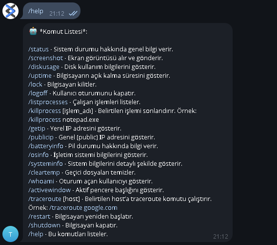

# 🖥️ Telegram Sistem Kontrol Botu

  
Telegram üzerinden bilgisayarınızı uzaktan yönetmenizi sağlayan kapsamlı bir sistem kontrol botu. Bu bot sayesinde ekran görüntüsü alabilir, işlemci ve bellek kullanımını görebilir, bilgisayarı kapatabilir veya yeniden başlatabilirsiniz.

---

## 📌 Özellikler

- ✅ **CPU ve RAM durumu** anlık öğrenme
- 📷 **Ekran görüntüsü** alma ve gönderme
- 💾 **Disk kullanımı** yüzdesi
- ⌛ **Bilgisayarın açık kalma süresi**
- 🖥️ **Aktif pencere başlığını** gösterme
- 🗂️ **Çalışan işlemleri** listeleme ve sonlandırma
- 🌐 **IP adresi ve ağ bilgileri**
- 🔒 **Bilgisayarı kilitleme, uyutma, yeniden başlatma veya kapatma**
- 🔋 **Pil durumu** ve yüzde bilgisi
- 👥 **Kullanıcı listesi ve oturumlar**

---

## 🧰 Gereksinimler

Projeyi çalıştırmadan önce aşağıdaki Python kütüphanelerini kurmanız gerekmektedir:

```bash
pip install psutil requests mss
````

---

## ⚙️ Kurulum

1. **Bot oluşturun:** Telegram’da [BotFather](https://t.me/BotFather) üzerinden bir bot oluşturun ve **token** bilgisini alın.
2. **Kodları düzenleyin:**

   * `TOKEN` ve `CHAT_ID` değerlerini kendi bilgilerinizle değiştirin.
3. **Script’i başlatın:**

```bash
python bot.py
```

---

## 💬 Kullanılabilir Komutlar

| Komut         | Açıklama                                   |
| ------------- | ------------------------------------------ |
| `/help`       | Komut listesini gönderir                   |
| `/screenshot` | Anlık ekran görüntüsü alır                 |
| `/cpu`        | İşlemci kullanım oranını gösterir          |
| `/ram`        | RAM kullanım oranını gösterir              |
| `/uptime`     | Bilgisayarın çalışma süresini gösterir     |
| `/disk`       | Disk kullanımı bilgilerini gösterir        |
| `/ip`         | IP adresi ve ağ bilgilerini gösterir       |
| `/battery`    | Pil durumu bilgisi verir                   |
| `/lock`       | Bilgisayarı kilitler                       |
| `/shutdown`   | Bilgisayarı kapatır                        |
| `/reboot`     | Bilgisayarı yeniden başlatır               |
| `/sleep`      | Uyku moduna alır                           |
| `/processes`  | Aktif işlemleri listeler                   |
| `/kill <pid>` | Belirtilen PID’ye sahip işlemi sonlandırır |

---

## 🔐 Güvenlik

* **chat\_id** kontrolü sayesinde sadece sizin belirlediğiniz kişi komut gönderebilir.
* Telegram botu, dış dünyaya açık bir kontrol paneli yerine güvenli ve sade bir arayüz sağlar.

---

## 📁 Dosya Yapısı

```
📁 Telegram-Pc-Controller
│
├── bot.py             # Ana bot dosyası
├── requirements.txt   # Gereken kütüphaneler
└── README.md          # Proje açıklamaları
```

---

## 📸 Ekran Görüntüsü (Opsiyonel)

>

---

## 🧠 Geliştirme Notları

İleride eklenmesi planlanan özellikler:

* 🔍 Kamera görüntüsü alma (ön/arka kamera desteği olan cihazlar için)
* ⌨️ Uzaktan komut satırı kontrolü
* 📤 Dosya gönderme ve alma desteği

---

## 👨‍💻 Geliştirici

**Adınız Soyadınız**
GitHub: [github.com/Troxgen](https://github.com/Troxgen)
Telegram: [@TR0XG3N](https://t.me/@TR0XG3N)

---

## 📜 Lisans

Bu proje MIT lisansı ile lisanslanmıştır – detaylar için [LICENSE](./LICENSE) dosyasını inceleyin.

